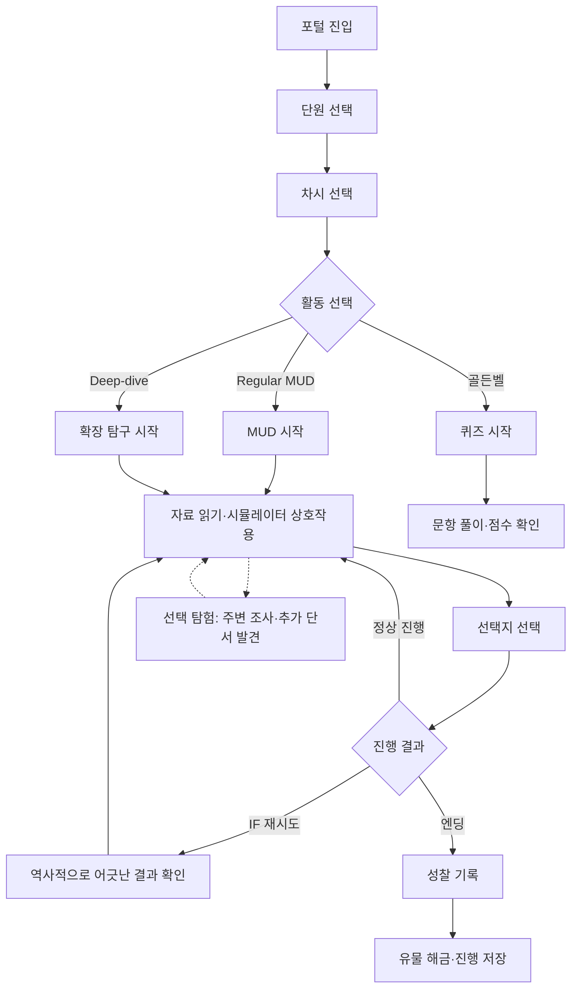
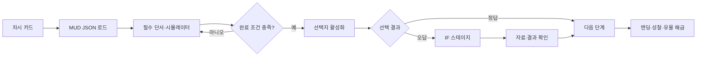

# 사용자 흐름 및 플로우차트

## 학생 전체 흐름

## Regular MUD 흐름

## 시스템 흐름 원칙

- 포털은 `_index.json`을 우선 사용한다.
- MUD 본문과 시뮬레이터 계약은 JSON에 선언한다.
- 필수 상호작용을 완료하기 전에는 다음 선택지를 진행시키지 않는다.
- 클리어 보상과 즉시 진행 상태는 localStorage에 저장한다.
- 선택 탐험은 필수 경로를 막지 않는 선택적 자료 발견으로 설계한다. 현재 구현 대상이 아니라 최소 실험 후보이다.
- 현재는 서버 계정이나 교사 대시보드로 데이터를 전송하지 않는다. 향후 Supabase를 도입하더라도 첫 단계는 익명 플레이 이벤트로 제한하며, 핵심 흐름은 네트워크 장애 시 유지한다.
