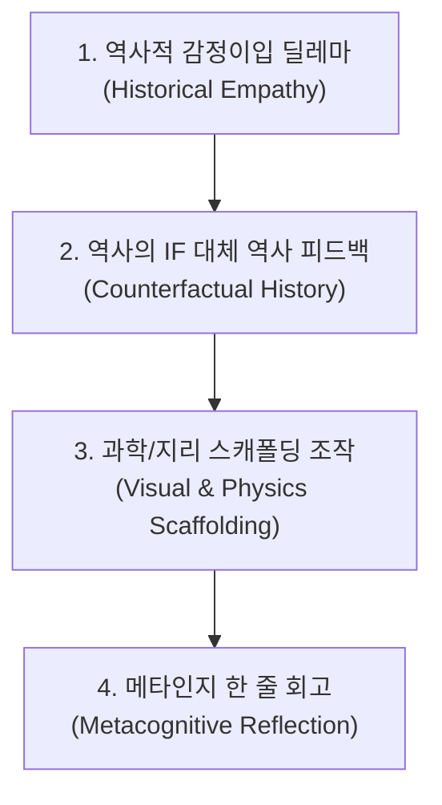

# 🏛️ 초등 역사 MUD 프레임워크 & 수업 확장 전략 가이드

- **작성일**: 2026-08-24
- **목적**: 1인 1기기 환경의 5분 마무리 활동 ➔ 40분 심화 탐구(메이커 교육)로 이어지는 범용 역사 MUD 아키텍처 수립

---

## 🌟 1. 교육학적 MUD 설계의 4대 핵심 기둥



1. **역사적 감정이입 (Historical Empathy) 딜레마**
   - 단순 암기식 문답이 아닌, 역사적 인물의 고뇌, 책임감, 절박함 속에서 리더십을 발휘하는 의사결정 선택지 배치.
2. **'역사의 IF (만약에)' 대체 역사 피드백**
   - 실패 분기 시 단순 "게임 오버"가 아니라, *"전하의 이번 선택으로 조선의 역사는 이렇게 흘러갔습니다..."*라는 가상 역사 시뮬레이션 제공으로 실제 역사의 필연성과 가치 깨달음 유도.
3. **시각적/과학적 스캐폴딩(비계) 인터랙션**
   - 캔버스 조작, 조류 슬라이더, 지리적 지도 협로 분석 등 조작형 샌드박스를 결합하여 다감각 몰입 지원.
4. **메타인지 학습 정리용 '한 줄 회고' (에필로그)**
   - 게임 성공 후 자신이 내린 결정 중 가장 고뇌했던 순간을 돌아보며 짧은 일기나 장계(보고서)를 작성하는 성찰 활동.

---

## 🚀 2. 범용 역사 MUD 시나리오 생성 만능 프롬프트

```markdown
"당신은 초등 역사 교육 전문가이자 에듀테크 게임 디자이너입니다. 오늘 배운 초등학교 역사 단원 **[주제/인물 입력]**을 주제로, 1인 1기기로 5분 안에 플레이할 수 있는 몰입형 텍스트 어드벤처(MUD) 게임 시나리오를 작성해 주세요.

다음의 교육학적 필수 요소를 반드시 포함하여 5개의 메인 섹션과 3개 이상의 실패 분기로 설계해 주세요:
1. 역사적 감정이입 (Historical Empathy) 딜레마
2. '역사의 IF (만약에)' 피드백 (실패 분기)
3. 시각적/과학적 스캐폴딩(비계) 요소 제안 (캔버스/조작)
4. 메타인지 학습 정리용 '한 줄 회고' (에필로그 장계 미션)

초등학교 고학년 어휘와 긴장감 넘치는 문체로 작성해 주세요."
```

---

## 💡 3. 수업 2단계 확장 전략 (5분 마무리 ➔ 40분 메이커 탐구)

### ✅ [1단계] 5분 차시 마무리 활동 (플레이어 모드)
- 수업 종료 5분 전 1인 1기기(크롬북/태블릿)로 개별 접속하여 플레이.
- 실패 분기의 '역사의 IF'를 통해 실제 역사적 결단의 위대함을 스스로 체득.

### ✅ [2단계] 40분 심화 메이커 탐구 활동 (기획자 모드)
- **활동명**: "우리가 만드는 대체 역사 MUD 게임 프로젝트"
- **모둠별 사건 분담**: 살수대첩, 병자호란, 3·1 운동, 훈민정음 창제 등
- **역사적 근거 기반 IF 분기 설계**: 사료와 교과서를 검색하여 개연성 있는 가상 역사 시나리오 구성.
- **상호 플레이 & 피드백**: 구글 설문지나 MUD 템플릿으로 구현하여 모둠 간 교환 플레이 및 동료 평가.
