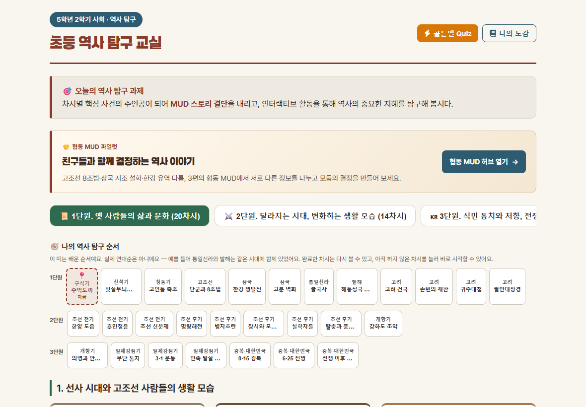
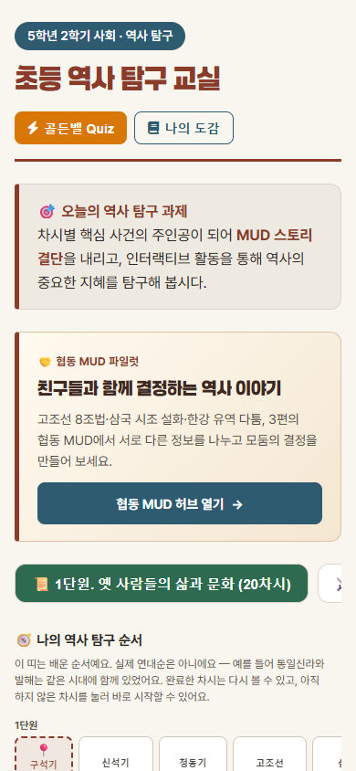
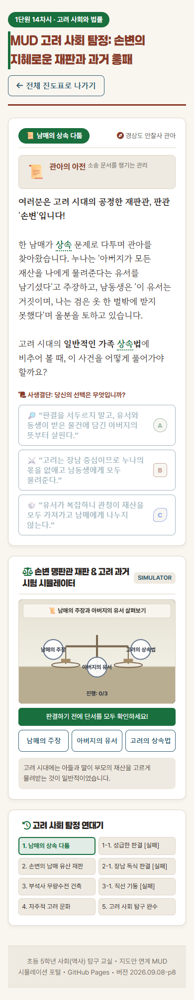
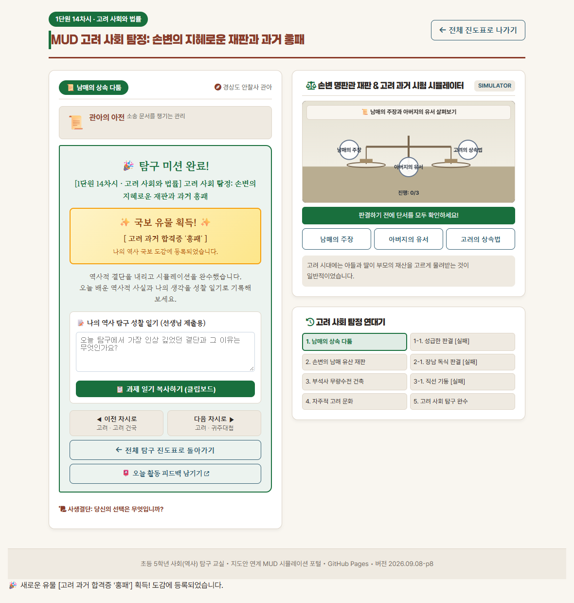
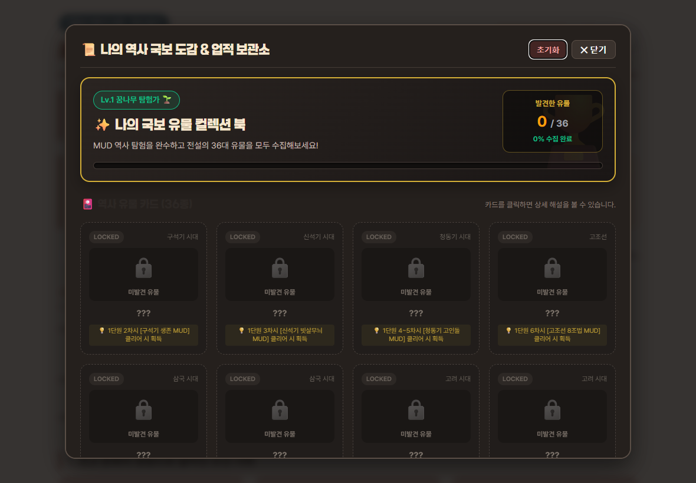
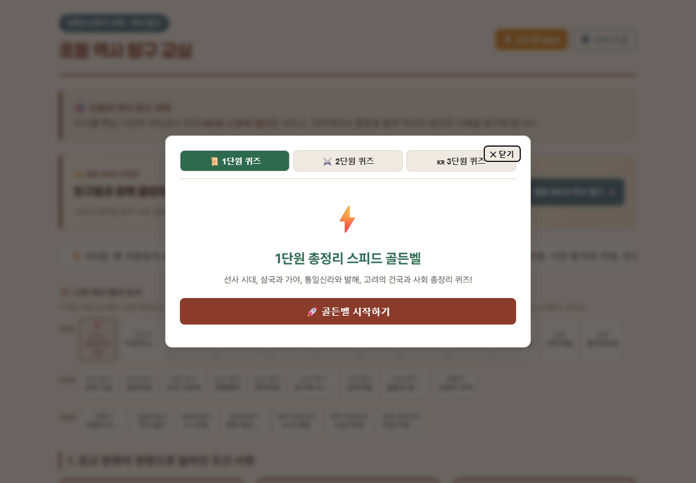

# 웹사이트 전체 구성 검토 — 2026-09-28

`TASK-20260928-SITE-STRUCTURE-REVIEW | 포털·MUD·도감·협동 허브 구성 검토 | 기획·점검 에이전트(Claude) | 상태: DONE(검토만, 구현 없음)`

- 대상: 배포 사이트 `https://joonssem.github.io/history_game/`(`main` `09cc5139` 기준)
- 방법: Edge + Playwright로 화면을 실제로 열고 찍었다. `index.html`·`js/app.js`의 구조를 읽고, 구획 높이·버튼 수·명암비를 측정했다.
  - 화면 크기: 태블릿 가로 1180×820(수업 기본 기기), 휴대폰 390×844
  - 확인한 화면: 포털(1·2단원 탭), 도감, 골든벨, MUD 진행·완료 화면, 협동 MUD 허브
- 범위: 검토와 제안만 한다. 코드·데이터는 바꾸지 않았다. 제안은 [`BACKLOG.md`](../../BACKLOG.md) `P2-SITE-STRUCTURE`로 등록한다(Codex의 BACKLOG 작업 커밋 뒤 반영).
- 원칙: 큰 구조 변경은 수업 관찰(D-033) 뒤에 판단한다. 학생이 헷갈리거나 못 보는 문제는 먼저 고칠 후보로 분리했다.

## 1. 결론

**처음 구성("지도안 차시 카드에서 MUD를 연다")은 수업의 뼈대로는 여전히 맞다.** 교사가 "오늘은 14차시"라고 말하면 학생이 단원 탭과 차시 카드에서 바로 찾는 흐름은 지금도 가장 자주 쓰인다.

**그러나 그 위에 활동이 쌓이면서 포털이 "긴 한 장짜리 목록"이 됐다.** 새 활동은 각자 들어온 자리에 붙었고, 전체를 묶는 구조는 없다.

- **길이**: 태블릿에서 1단원 포털은 화면 4.6장, 휴대폰에서는 9.4장이다. 링크·버튼은 65개다.
- **확장 활동 위치**: 타임머신 스토리·미니게임은 태블릿에서 약 3,100px 아래, 맨 끝에 있다. 제목은 명암비 1.09:1로 사실상 보이지 않는다.
- **유물·유적 비교**(11페어): 포털에 입구가 없다. MUD 완료 화면과 도감 카드 안에서만 들어간다.
- **내비게이션 중복**: 연대표 띠(28칸, 세 단원 모두 표시)와 단원 탭(한 단원만 표시)이 같은 화면에서 따로 움직인다.
- **협동 MUD**: 파일럿인데 단원 탭보다 위에서 큰 배너를 차지한다.
- **테마 불일치**: 포털은 밝은 한지 테마인데, 도감·확장 활동·딥다이브 배너는 어두운 테마다.
- **휴대폰 MUD**: 선택지가 시뮬레이터보다 위에 있다. 학생은 잠긴 선택지를 먼저 보고, 아래로 내려가 단서를 찾아야 선택지가 열린다.

따라서 **뼈대는 유지하되, 포털을 "오늘 할 것 → 차시 탐험 → 더 탐구하기 → 모둠 활동"의 몇 개 구역으로 다시 묶는 것**을 제안한다. 당장은 학생이 못 보거나 헷갈리는 문제 7개를 먼저 고치고, 구조 개편은 수업 관찰 결과로 순서를 정한다.

## 2. 처음 의도와 지금의 차이

| 항목 | 처음 구성 | 지금 |
|---|---|---|
| 중심 | 차시 카드 → MUD 1편 | 차시 카드 → Regular 28편(탐구형 4편 포함) + Deep-dive 4편 |
| 진도 표시 | 없음 | 연대표 띠 28칸(완료·지금 표시), 완료 화면의 이전·다음 차시 |
| 수집 | 도감 | 도감 36종 + 유물·유적 비교 11페어(도감 안) |
| 확장 활동 | 미니게임 | 타임머신 스토리 3편 + 미니게임 4종(포털 맨 아래) |
| 모둠 활동 | 없음 | 정적 협동 MUD 3편(별도 허브) + 실시간 협동 3편(별도 앱, Preview) |
| 복습 | 골든벨 | 골든벨 3개 단원(헤더 버튼) |
| 성찰 | 성찰 일기 복사 | 성찰 일기 복사(실사용 없음, BACKLOG 2026-09-08) + 설문 링크 |

지금 구조에서 활동은 **들어온 순서대로 붙어 있다**. 협동은 탭 위의 배너, 연대표는 탭과 카드 사이, 비교는 도감 안, 스토리·게임은 맨 아래에 있다. 학생 입장에서 "무엇을 먼저 하고, 무엇이 더 있는지"를 한눈에 보여 주는 층이 없다.

## 3. 화면별 관찰

### 3-1. 포털 첫 화면



| 구획(태블릿) | 높이 | 관찰 |
|---|---|---|
| 헤더(제목·골든벨·도감) | 105px | 골든벨과 도감만 상단에 있다. 비교·스토리·게임·협동은 여기서 보이지 않는다. |
| 오늘의 역사 탐구 과제 | 86px | 모든 날 같은 문장이다. "오늘"에 해당하는 정보(오늘 차시, 이어서 할 편)가 없다. |
| 협동 MUD 파일럿 배너 | 126px | 모든 학생이 매번 지나가는 자리를 파일럿이 차지한다. 휴대폰에서는 230px이다. |
| 단원 탭 | 47px | 3단원 탭이 오른쪽 밖(1251px, 화면 1180px)으로 잘린다. |
| 연대표 띠 | 260px | 탭과 상관없이 세 단원을 모두 보여 준다. 칸 제목이 "빗살무늬…", "장시와 모…"처럼 잘린다. |
| 차시 카드 | 2,331px | 1단원 20개 카드. 교과서 전용 차시는 회색 "교과서 탐구 차시" 버튼이고, 나뉜 차시(4~5차시 1/2·2/2)는 같은 MUD 버튼이 두 번 나온다. |
| 확장 역사 활동 | 489px | 페이지 맨 끝이다. 제목 글자색 `#2C2724`가 배경 `#25201D`와 거의 같다(명암비 1.09:1). |



휴대폰 첫 화면에는 제목·과제 안내·협동 배너만 보인다. 차시 카드는 1,083px 아래에서 시작한다.

### 3-2. MUD 화면

- **태블릿**: 왼쪽에 이야기·선택지, 오른쪽에 시뮬레이터·연대기가 있어 흐름이 자연스럽다.
- **휴대폰(문제)**: 한 줄로 쌓이면서 **선택지 → 시뮬레이터** 순서가 된다. 선택지는 단서를 다 찾기 전까지 흐리게 잠겨 있는데, 풀어야 할 단서는 그 아래에 있다. 학생은 "왜 안 눌리지?"를 먼저 겪는다.



- **학생에게 보이는 개발 용어**: 제목 앞 "MUD", "SIMULATOR" 배지, 포털의 "Deep-dive MUD (30분+ 롤플레이)"가 그대로 보인다.
- **오답 분기 노출**: 오른쪽 "연대기"가 "1-1. 성급한 판결 [실패]" 같은 오답 분기와 [실패] 표시를 처음부터 모두 보여 준다. 정답 경로를 미리 알려 주는 셈이고, 초등학생에게 [실패]라는 말이 반복된다.
- **낡은 부제목**: 시뮬레이터 제목 `header.interactiveTitle`이 "손변 명판관 재판 & 고려 과거 시험 시뮬레이터"처럼 옛 단계 구성을 담고 있다. 오늘 점검한 단계 칸 불일치와 같은 유형인데, 헤더라서 `scripts/18`이 보지 않는다.

### 3-3. MUD 완료 화면



- 완료 패널(유물 획득·이전/다음 차시·진도표·피드백)은 좋다. 특히 이전·다음 차시 이동은 연대표 띠와 잘 맞는다.
- **오른쪽 시뮬레이터가 1단계 상태로 남는다**("진행 0/3", "판결하기 전에 단서를 모두 확인하세요!"). 완료 뒤에도 할 일이 남은 것처럼 보인다.
- 완료 패널 아래에 "사생결단: 당신의 선택은 무엇입니까?" 제목이 빈 채로 남는다.
- 성찰 일기 복사는 2026-09-08 확인 결과 실제로 쓰이지 않는다. 그런데도 완료 화면에서 가장 큰 입력 영역이다.
- 유물·유적 비교 제안은 조건(해금 수)을 넘을 때만 이 자리에 나온다. 포털에는 입구가 없어, 비교 활동이 있다는 사실을 모르는 학생이 많을 것이다.

### 3-4. 도감



- 어두운 테마라 포털(밝은 한지)과 다른 앱처럼 보인다. "🎴 역사 유물 카드 (36종)" 제목도 어두운 배경에서 대비가 낮다.
- "초기화" 버튼이 "닫기" 바로 옆에 강조색으로 있다. 확인 창이 있지만, 초등학생이 실수로 누르기 쉬운 자리다.
- 비교 활동은 해금한 유물 카드 안에서만 들어간다. 처음 여는 학생(0/36)에게는 비교 활동이 보이지 않는다.

### 3-5. 골든벨



- "닫기" 버튼이 3단원 탭 위에 겹친다.
- 골든벨은 헤더 버튼과 단원 마지막 카드("생각 그물 완성 / 교실 놀이 Quiz") 두 곳에서 들어간다. 두 입구의 이름이 다르다.

### 3-6. 협동 MUD 허브

- 밝은 테마, 카드형 목록, "비대칭 정보 → 개인 판단 → 정보 공유 → 공동 결정" 설명, 교사 안내까지 포털보다 정돈되어 있다. 포털 개편의 참고 모델로 쓸 수 있다.
- "DB 없이 실행" 배지는 교사·개발자용 표현이다.
- 실시간 협동 3편은 Preview라서 링크하지 않은 것이 맞다(개인정보 게이트).

### 3-7. 그 밖

- 하단 버전 표시가 "2026.09.08-p8"에 멈춰 있다. 이후 배포가 많아 실제 버전을 알 수 없다.
- 단원 이름이 세 곳에서 다르다. 교육과정 데이터 기준을 정하고 한 곳에서 가져오게 해야 한다.
  - 포털 탭: "옛 사람들의 삶과 문화"
  - `curriculum_full.json`·`curriculum_standards_2022.json`: "유적과 유물로 살펴본 옛 사람들의 생활" 등
  - README 표: "사회의 새로운 변화와 오늘날의 우리" 등 옛 이름
- 차시 카드에는 교과서 쪽수(사12~14p)와 "💡 핵심 개념"이 들어 있다. 교사에게는 유용하지만 학생 화면을 길게 만든다.

## 4. 나아질 점

### 4-A. 먼저 고칠 것 — 학생이 못 보거나 헷갈리는 문제 (제안 P1)

구조를 바꾸지 않고 CSS·작은 스크립트로 고칠 수 있다. 수업 관찰과 상관없이 해도 된다.

| # | 문제 | 제안 | 관련 파일 |
|---|---|---|---|
| A1 | 확장 역사 활동 제목이 안 보임(1.09:1) | 어두운 섹션의 제목·본문 색을 밝게, 명암비 4.5:1 이상 | `css/style.css` |
| A2 | 3단원 탭이 태블릿에서 잘림 | 탭 줄바꿈 또는 가로 스크롤 표시, 차시 수 괄호를 둘째 줄로 | `css/style.css`, `index.html` |
| A3 | 휴대폰 MUD에서 선택지가 시뮬레이터보다 위 | 좁은 화면에서 시뮬레이터(단서)를 선택지 위로 올리거나, 잠긴 선택지에 "위/아래 단서를 먼저 찾아요" 안내와 이동 버튼 | `css/style.css`, `js/mudEngine.js` |
| A4 | 완료 뒤 시뮬레이터가 1단계 상태로 남음 | 완료 시 시뮬레이터 카드를 숨기거나 "탐구 완료" 요약으로 바꾸고, 빈 "사생결단" 제목 숨김 | `js/mudEngine.js` |
| A5 | 골든벨 "닫기"가 탭과 겹침 | 닫기 버튼을 탭 줄 밖으로 | `index.html`, `css/style.css` |
| A6 | 연대기에 오답 분기·[실패]가 처음부터 보임 | 방문한 단계만 보이기, [실패] → "다시 생각하기" | `js/mudEngine.js` |
| A7 | 하단 버전 표시 멈춤 | 캐시버스터와 같은 값을 쓰거나 배포 날짜 표시 | `index.html` |

### 4-B. 포털 구조 개편 (제안 P2, 수업 관찰 뒤 순서 결정)

한 장 페이지와 Vanilla JS 구조는 그대로 두고(D-002 Vanilla JS·D-003 GitHub Pages), **포털을 네 구역으로 다시 묶는다.** 협동 허브의 정돈된 카드 방식을 참고한다.

```text
[헤더]  초등 역사 탐구 교실                         [도감] [골든벨]
[구역 이동] 오늘 할 것 | 차시 탐험 | 더 탐구하기 | 모둠 활동

① 오늘 할 것 (첫 화면)
   - "이어서 하기": 연대표 띠의 '지금' 칸을 큰 카드로 (예: 14차시 고려 사회 탐정 ▶)
   - 오늘 해금된 비교 활동이 있으면 함께 표시
② 차시 탐험
   - 연대표 띠 = 주 내비게이션. 단원 탭은 띠를 단원별로 접는 필터로 합친다.
   - 차시 카드는 MUD가 있는 차시만 기본 표시. 교과서 전용 차시·교사용 쪽수는 "교사 보기"로 접는다.
   - 나뉜 차시(4~5차시 1/2·2/2)는 카드 하나로 합친다.
   - Deep-dive는 단원 끝 "대단원 도전" 카드로 모은다.
③ 더 탐구하기
   - 유물·유적 비교(해금 수와 다음 해금 조건 표시), 타임머신 스토리, 미니게임 4종, 골든벨을 한 구역 카드로
④ 모둠 활동
   - 정적 협동 MUD 3편 카드(허브로 연결). 교사 안내 링크.
   - 실시간 협동은 개인정보 게이트 해제 전까지 표시하지 않는다.
```

- 기대 효과: 태블릿 첫 화면에서 오늘 할 활동과 다른 활동의 존재를 한 번에 본다. 스크롤 길이는 차시 카드 접기만으로 크게 줄어든다(1단원 20장 → MUD가 있는 12장 + 대단원 도전 2장).
- 위험: 교사가 익숙한 "단원 탭 → 차시 카드" 흐름을 바꾸게 된다. **첫 단계는 ①만 추가하고 ②~④는 기존 위치를 유지한 채 구역 이동 버튼만 붙인다.** 관찰에서 학생이 실제로 헤매는 지점을 본 뒤 나머지를 옮긴다.

### 4-C. 시각·언어 일관성 (제안 P2)

- **테마**: 도감·확장 활동·딥다이브 배너의 어두운 테마를 포털의 한지 팔레트로 맞추거나, "보관소(도감)=어두운 테마"처럼 역할별 규칙을 정해 문서화한다. 색은 `css/style.css`의 변수로 모은다.
- **학생용 말**:
  - "MUD" → "역사 탐험" 또는 "이야기 탐험"
  - "Deep-dive MUD (30분+ 롤플레이)" → "대단원 도전"
  - "SIMULATOR" → "탐구 도구"
  - "DB 없이 실행" → 교사 안내로 이동
  - 내부 파일명과 데이터 이름(`mudId`)은 그대로 둔다.
- **오늘의 과제 상자**: 고정 문장 대신 ①의 "이어서 하기"로 대체하거나 교사가 바꿀 수 있는 문장으로.
- **단원 이름**: 교육과정 데이터(`curriculum_standards_2022.json`)를 기준으로 탭·README·완료 화면을 맞춘다.

### 4-D. 정리할 것 (제안 P3)

- **성찰 일기 복사**: 실사용이 없으므로 접힌 영역으로 줄이거나 설문 링크 하나로 합친다(2026-09-08 BACKLOG 판단과 연결).
- **도감 "초기화"**: 닫기 옆 강조색에서 도감 맨 아래 "기록 관리"로 옮긴다.
- **골든벨 입구 이름 통일**: 헤더 "골든벨 Quiz"와 단원 끝 카드 "생각 그물 완성 / 교실 놀이 Quiz"
- **`header.interactiveTitle`·`roadmap` 라벨 점검 범위 추가**: `scripts/18` 재설계 때 헤더와 로드맵 라벨도 비교 대상에 넣는다(P1-STAGE-COHERENCE-A).

## 5. 관찰 때 확인할 질문 (D-033 기록지에 추가 제안)

1. 학생이 포털에 들어와 오늘 차시를 찾기까지 몇 번 스크롤·터치하는가? 연대표 띠를 누르는가, 탭·카드를 쓰는가?
2. MUD를 마친 학생이 다음에 무엇을 하는가? 다음 차시, 도감, 비교, 스토리·게임 중 어디로 가는가? 확장 활동이 있다는 걸 아는가?
3. 휴대폰·태블릿 세로에서 잠긴 선택지를 먼저 누르려다 멈추는 학생이 있는가?
4. 연대기의 [실패] 칸을 보고 정답을 미리 고르는 학생이 있는가?
5. 도감을 연 학생이 비교 활동을 찾는가?

## 6. 측정 기록

| 항목 | 태블릿 1180×820 | 휴대폰 390×844 |
|---|---|---|
| 포털 1단원 높이 | 3,742px(화면 4.6장) | 7,892px(화면 9.4장) |
| 포털 2단원 높이 | 3,353px | 6,097px |
| 포털 링크·버튼 수 | 65 | 65 |
| 차시 카드 시작 위치 | 766px | 1,083px |
| 확장 활동 시작 위치 | 3,126px | 6,709px |
| MUD 1단계 높이 | — | 2,006px |
| 확장 활동 제목 명암비 | 1.09:1 | 1.09:1 |
| 3단원 탭 오른쪽 끝 | 1,251px(화면 밖) | 가로 스크롤 |

- 스크린숏은 [`assets/site_structure_20260928/`](./assets/site_structure_20260928/)에 있다(6장).
- 측정 스크립트는 세션 스크래치(Playwright + Edge)에서 돌렸고 저장소에는 넣지 않았다.
- 명암비 측정 중 딥다이브 배너 2곳은 배경 이미지를 흰색으로 잘못 읽은 측정 오류라 제외했다.
